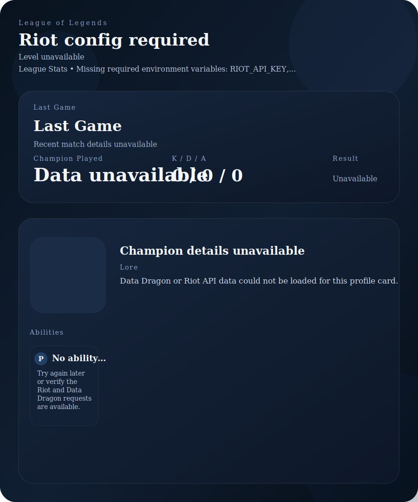

<!-- GitHub Profile README -->

# Hiya I am Zi

*Consultant Analyst · BJJ🟦⬛️🟦[Gi] · Kickboxer . ARAM Enjoyer*

---

## 💼 Work

I studied IMEE at the University of Bath.
 
Then worked as **Market Researcher** in the Media Entertainment Industry
 
Now I am working as **Analyst Consultant** in the Banking Industry

I like to make some random stuff for fun or help me automate my hobby and work :D

I (am going to) made this to compile stuff I have learnt as a reminder for myself and maybe some others can find it useful — built and hosted via GitHub Pages.

> **[→ Visit yourname.dev](https://yourname.dev)**

---

## 🎮 Gaming

Mainly League of Legends on EUW. Stats below auto-refresh every day via GitHub Actions.

<!-- The lol-stats.svg file is auto-generated by .github/workflows/lol-stats.yml -->
<!-- Do not edit it manually — it will be overwritten on the next run -->

---

  README auto-updates daily · built with GitHub Actions + Riot API

